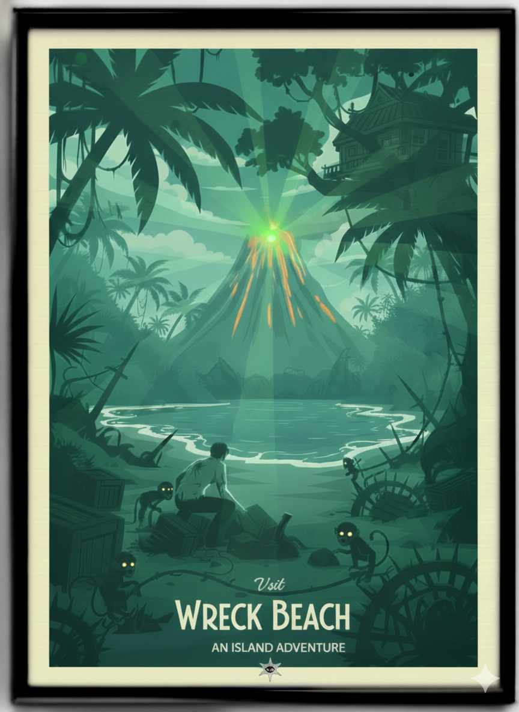

# BUUI Adventure

Last verified: 2025-12-30 (v1.0 deep clean)

A 1980s-style, turn-based text adventure engine with a modern AI-assisted CLI mode.
You can play it, inspect the prompts, and tune the mechanics and content.

## What this repo is
- A deterministic text adventure engine with a structured YAML content pipeline.
- A CLI that can run in classic mode (1980) or AI-assisted mode (2025).
- A sandbox for prompt-driven translation and narration, with strict mechanics.
- A toolkit for authoring and validating games via CLIs.

## Requirements
- Java 17
- Maven
- Optional: OPENAI_API_KEY for 2025 mode

## Quick start
- Build and test: `mvn -q test`
- Classic CLI (no AI): `./adventure --mode=1980`
- AI CLI (translator + narrator): `OPENAI_API_KEY=... ./adventure --mode=2025`

Example commands in the CLI:
- `move north`
- `look`
- `take key`
- `inventory`
- `craft torch`
- `help`
- `quit`

Notes:
- MOVE is the canonical movement verb. GO is accepted as an alias.
- The game menu loads from `src/main/resources/games/<id>/game.yaml`.

## Project layout
- `src/main/java/com/demo/adventure/engine/` CLI runtime (cli/runtime/flow), command pipeline (command/interpreter/handlers), mechanics (ops/crafting/combat/keyexpr/cells)
- `src/main/java/com/demo/adventure/ai/` runtime AI (translator/narrator + DM/smart actors) and authoring AI clients
- `src/main/java/com/demo/adventure/domain/` model/kernel/save schema shared by engine + authoring
- `src/main/java/com/demo/adventure/authoring/` CLIs and world builders (cli/save/lang/gardener/zone/samples)
- `src/main/java/com/demo/adventure/support/` shared exceptions
- `src/main/resources/games/<id>/` structured game YAML (`game.yaml` + `world/` + `narrative/` + `motif/` + `assets/`)
- `src/main/resources/agents/` runtime translator/narrator templates + AI role prompts/contracts
- `src/main/resources/storybook/` narrative authoring bundles (backstory, quests, recipes, story)
- `src/test/resources/zone-demo/` sample input bundle for ZoneBuilder
- `docs/index.md` docs index, `docs/design/readme.md` design overview
- `docs/bujo/` daily logs and `docs/journal.md` scope/test notes

## Authoring and changing game dynamics

### Structured YAML (runtime content)
Each game lives under `src/main/resources/games/<id>/`.
`game.yaml` includes the rest:
```yaml
id: island-adventure
title: Island Adventure
seed: 20240615
startPlotKey: wreck-beach
preamble: Salt stings your lips...
includes:
  map: world/map.yaml
  fixtures: world/fixtures.yaml
  items: world/items.yaml
  actors: world/actors.yaml
  descriptions: narrative/descriptions.yaml
```

### Gates, movement, and key expressions
Movement is driven by gate Things in `world/map.yaml`.
- `direction` controls movement.
- `visible` controls whether the exit is shown at all.
- `keyString` is a quoted GEL expression evaluated at runtime.

Example gate:
```yaml
gates:
  - id: gate-wreck-to-jungle
    from: wreck-beach
    to: jungle-edge
    direction: NORTH
    visible: true
    keyString: 'HAS("Key") && DICE(6) > 2'
    description: The brush parts if the lock yields.
```

Key rules:
- Expressions must be quoted strings in YAML. They are not compiled at load time.
- `visible: false` hides a thing regardless of `keyString`.
- Use `keyString` for conditional visibility (see `docs/design/key-expression.md`).

### Fixtures, items, actors
Use `world/fixtures.yaml`, `world/items.yaml`, and `world/actors.yaml` for placement and behavior.
- Set `visible: true` with a `keyString` to gate visibility.
- Items and fixtures can have descriptions, labels, and ownership (via fixtures).

### Inventory and containers
Inventory is a container with capacity. Items can also be containers.
- `capacityWidth` / `capacityHeight` define container capacity.
- `footprintWidth` / `footprintHeight` define item size.
- The engine uses `ContainerPacker` to enforce capacity.

### Crafting
Recipes live in `src/main/resources/games/<id>/world/crafting.yaml`.
```yaml
recipes:
  - emitLabel: Lit Torch
    emitDescription: A torch burning clean and bright.
    consume: [Torch, Kerosene]
    skill: Firemaking
    requirements: [Flint]
```
Crafting rules:
- The actor must have the required `skill` in `actors.yaml`.
- `consume` items are removed; `requirements` are checked but retained.
- Crafting is routed via the CraftingTable, not bespoke CLI logic.

### Storybook (narrative bundles)
`src/main/resources/storybook/` holds authoring assets for narrative, not runtime loading:
- `backstory.md`, `story.md`, `quests.md`, `recipes.yaml`
- Use this for design work and content review.

### Command language
- `CommandScanner` normalizes verbs; MOVE is canonical, GO is an alias.
- CRAFT is normalized to MAKE, GRAB to TAKE, EXPLORE to SEARCH.
- The CLI routes through the command compiler and interpreter (no hand parsing).

## CLI tools
- Game play: `com.demo.adventure.engine.cli.GameCli`
- Validate and round-trip a save: `com.demo.adventure.authoring.cli.GameBuilderCli`
  - `mvn -q -Dexec.mainClass=com.demo.adventure.authoring.cli.GameBuilderCli \
    -Dexec.args="src/main/resources/cookbook/gardened-mansion.yaml --out logs/mansion-roundtrip.yaml --bom --report" exec:java`
- Export structured YAML: `com.demo.adventure.authoring.cli.GameStructExporter`
- Architect walkabout graphs: `com.demo.adventure.authoring.cli.ArchitectCli`
- Zone builder: `com.demo.adventure.authoring.cli.ZoneBuilderCli`
  - `mvn -q -Dexec.mainClass=com.demo.adventure.authoring.cli.ZoneBuilderCli \
    -Dexec.args="--in src/test/resources/zone-demo/zone-input.sample.yaml --out logs/zone-game.yaml --structured-out logs/structured --id demo --title 'Demo Game' --metrics --strict --seed 42" exec:java`
- Storybook validation: `com.demo.adventure.authoring.cli.StorybookValidateCli`

## AI mode (2025)
- Mode selection: `--mode=1980` or `--mode=2025`.
- Translator maps player text to commands; narrator rewrites the engine output.
- Prompts:
  - Runtime translator template: `src/main/resources/agents/translator.md`
  - Narrator prompts are compiled on demand in `src/main/java/com/demo/adventure/ai/runtime/NarratorPromptBuilder.java`
  - Role contracts: `src/main/resources/agents/`
- Debug toggles live in `application.properties` (`ai.translator.debug`, `ai.narrator.debug`).

## Testing
- Full suite: `mvn -q test`
- Structured load check: `mvn -q -Dtest=GameMenuStructuredLoadTest test`
- If you change structured YAML, run the structured load test at minimum.

## Docs
- Docs index: `docs/index.md`
- Design overview: `docs/design/readme.md`
- Key expression syntax: `docs/design/key-expression.md`

## Island Adventure Travel Poster


## Mansion Adventure Travel Poster


## Spy Adventure Travel Poster


## Western Adventure Travel Poster

